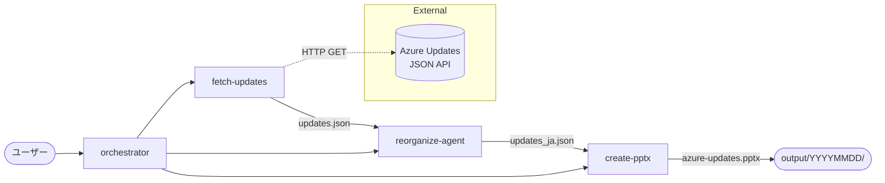

# ws-azupdate-catcher

Azure Updates の公式情報を取得し、日本語に翻訳・分類・精査したうえで、PowerPoint 資料として自動生成するワークフローです。VS Code / GitHub Copilot のサブエージェント機能を用いた多段パイプライン構成になっています。

[](LICENSE)

---

## 目次

- [概要](#概要)
- [アーキテクチャ](#アーキテクチャ)
- [ディレクトリ構成](#ディレクトリ構成)
- [前提条件](#前提条件)
- [セットアップ](#セットアップ)
- [使い方](#使い方)
- [出力フォーマット](#出力フォーマット)
- [カスタマイズ](#カスタマイズ)
- [トラブルシューティング](#トラブルシューティング)
- [ライセンス](#ライセンス)

---

## 概要

Azure の更新情報は [Azure Updates](https://azure.microsoft.com/updates/) で日々公開されていますが、件数が多く、英語であり、ステータスや影響範囲もまちまちです。本リポジトリは以下を自動化します。

1. **取得** — Azure Updates の公式 JSON API から最新の更新情報を取得
2. **翻訳・分類・精査** — 日本語化、ソリューションカテゴリ付与、重要度判定、重複/不整合のチェック
3. **資料生成** — テンプレートに沿った PowerPoint 資料 (`.pptx`) を出力

各ステップは GitHub Copilot のサブエージェント（[.github/agents/](.github/agents)）として独立しており、オーケストレーター経由で一気通貫に実行できます。

---

## アーキテクチャ



### サブエージェント

| エージェント | 役割 | 入力 | 出力 |
|---|---|---|---|
| [orchestrator](.github/agents/orchestrator.agent.md) | 全体統括。3つのサブエージェントを順番に呼び出す | ユーザー指示 | 最終レポート |
| [fetch-updates](.github/agents/fetch-updates.agent.md) | Azure Updates JSON API から更新情報を取得 | API クエリ | `output/YYYYMMDD/updates.json` |
| [reorganize-agent](.github/agents/reorganize-agent.agent.md) | 日本語翻訳 / カテゴリ付与 / 精査・レビュー | `updates.json` | `output/YYYYMMDD/updates_ja.json` |
| [create-pptx](.github/agents/create-pptx.agent.md) | 整理済みデータから PowerPoint を生成 | `updates_ja.json` + テンプレート | `output/YYYYMMDD/azure-updates.pptx` |
| [translate-ja](.github/agents/translate-ja.agent.md) | （単独翻訳のみ実行する場合の補助エージェント） | `updates.json` | `updates_ja.json` |

---

## ディレクトリ構成

```
ws-azupdate-catcher/
├── .github/
│   └── agents/                       # Copilot サブエージェント定義
│       ├── orchestrator.agent.md
│       ├── fetch-updates.agent.md
│       ├── reorganize-agent.agent.md
│       ├── create-pptx.agent.md
│       └── translate-ja.agent.md
├── scripts/
│   ├── fetch_updates.py              # Azure Updates API を叩いて JSON 保存
│   ├── fetch.ps1                     # PowerShell 版フェッチスクリプト
│   ├── generate_pptx.py              # python-pptx で PPTX を生成
│   ├── inspect_template.py           # テンプレートのレイアウト調査用
│   └── verify.ps1                    # 出力検証用
├── template/
│   └── template.pptx                 # スライドマスター / レイアウトを定義したテンプレート
├── output/
│   └── YYYYMMDD/                     # 実行日ごとに生成される成果物
│       ├── updates.json              # API レスポンス（HTML 除去済み）
│       ├── updates_ja.json           # 日本語化・分類済みデータ
│       └── azure-updates.pptx        # 生成された PowerPoint
├── .gitignore
└── README.md
```

---

## 前提条件

- **Python 3.10 以上**
- **PowerShell 7+**（`scripts/fetch.ps1` を使う場合）
- 以下の Python パッケージ
  - `python-pptx`

> ネットワーク経由で `https://www.microsoft.com/releasecommunications/api/v2/azure` にアクセスできる環境が必要です。

---

## セットアップ

```powershell
# 1. リポジトリを取得
git clone https://github.com/zukakosan/ws-azupdate-ppt-builder.git
cd ws-azupdate-ppt-builder

# 2. （推奨）仮想環境を作成
python -m venv .venv
.\.venv\Scripts\Activate.ps1

# 3. 依存パッケージをインストール
pip install python-pptx
```

---

## 使い方

### 方法 A: サブエージェント経由（推奨）

VS Code + GitHub Copilot Chat で、以下のように依頼するだけで全工程が自動実行されます。

```
過去1か月分の Azure Update の ppt つくって
```

`orchestrator` エージェントが起動し、`fetch-updates` → `reorganize-agent` → `create-pptx` の順に呼び出され、`output/YYYYMMDD/azure-updates.pptx` が生成されます。

特定のエージェントだけを呼び出すこともできます。

```
fetch-updates エージェントで直近2週間の更新だけ取って
```

### 方法 B: スクリプトを直接実行

#### 1. 更新情報を取得

```powershell
# Python 版
python scripts/fetch_updates.py

# もしくは PowerShell 版
pwsh scripts/fetch.ps1
```

#### 2. 翻訳・分類

サブエージェント `reorganize-agent` を Copilot から実行してください（純粋なスクリプト版は提供していません）。

#### 3. PowerPoint を生成

```powershell
python scripts/generate_pptx.py
```

`scripts/generate_pptx.py` の冒頭で `DATA_PATH` / `OUTPUT_PATH` を対象日付ディレクトリに合わせて編集してください。

---

## 出力フォーマット

### `updates.json`

API レスポンスを HTML タグ除去してプレーンテキスト化したもの。

```json
[
  {
    "id": "558027",
    "title": "...",
    "description": "...(プレーンテキスト)...",
    "status": "Launched",
    "created": "04/02/2026 16:45:52",
    "modified": "04/02/2026 16:45:52",
    "productCategories": ["Compute", "App Service"],
    "tags": ["Features"],
    "products": ["Azure Functions"],
    "generalAvailabilityDate": "2024-11",
    "previewAvailabilityDate": null,
    "availabilities": [
      { "ring": "General Availability", "year": 2024, "month": "November" }
    ]
  }
]
```

### `updates_ja.json`

`updates.json` に日本語訳・ソリューションカテゴリ・重要度・詳細リンクを付与したもの。

```json
[
  {
    "id": "558027",
    "title_en": "...",
    "title_ja": "...",
    "description_en": "...",
    "description_ja": "...",
    "status": "廃止予定",
    "importance": "high",
    "solutionCategory": "コンピューティング",
    "isDuplicate": false,
    "created": "04/02/2026 16:45:52",
    "productCategories": ["Compute", "App Service"],
    "tags": ["Features"],
    "products": ["Azure Functions"],
    "generalAvailabilityDate": "2024-11",
    "availabilities": [
      { "ring": "General Availability", "year": 2024, "month": "November" }
    ],
    "link": "https://azure.microsoft.com/updates/?id=558027"
  }
]
```

### `azure-updates.pptx`

| スライド | 内容 |
|---|---|
| 表紙 | タイトル「Azure Updates まとめ」 + 対象期間 |
| サマリー | ステータス別・カテゴリ別の件数 |
| 注目: 廃止 / サポート終了 | 主要な廃止予定の一覧 |
| カテゴリ区切り | ソリューションカテゴリごとのセクション見出し |
| 個別更新 | タイトル / ステータス / 重要度 / 説明 / 製品 / 可用性 / 詳細リンク |

並び順は **カテゴリ → 重要度 (high→low) → 作成日 (新しい順)** です。

---

## カスタマイズ

### スライドのデザインを変える

`template/template.pptx` を編集してください。スライドマスター・レイアウト・配色・フォントがそのまま継承されます。

### カテゴリ分類を変える

[reorganize-agent](.github/agents/reorganize-agent.agent.md) の「ソリューションカテゴリの付与」セクションを編集してください。`scripts/generate_pptx.py` の `CATEGORY_ORDER` も合わせて更新します。

### 取得期間を変える

- サブエージェント経由: プロンプトに期間を指定（例: 「直近2週間分」）
- スクリプト直接: `scripts/fetch_updates.py` の `FILTER` を編集

---

## トラブルシューティング

| 症状 | 対応 |
|---|---|
| `git push` が `non-fast-forward` で拒否される | `git pull --rebase` でリモートを取り込んでから再 push、もしくは feature ブランチを切って PR で取り込み |
| PPTX のタイトルが `...` で切れる | `scripts/generate_pptx.py` の `auto_size` 設定とフォントサイズ縮小ロジックを確認 |
| 箇条書きに `・` などが二重に付く | `description_ja` から先頭記号を除去するロジックを `scripts/generate_pptx.py` に追加 |
| 取得件数が 0 件 | `FILTER` の日付範囲が未来になっていないか確認 |
| `python-pptx` が見つからない | `pip install python-pptx` |

---

## ライセンス

MIT License
